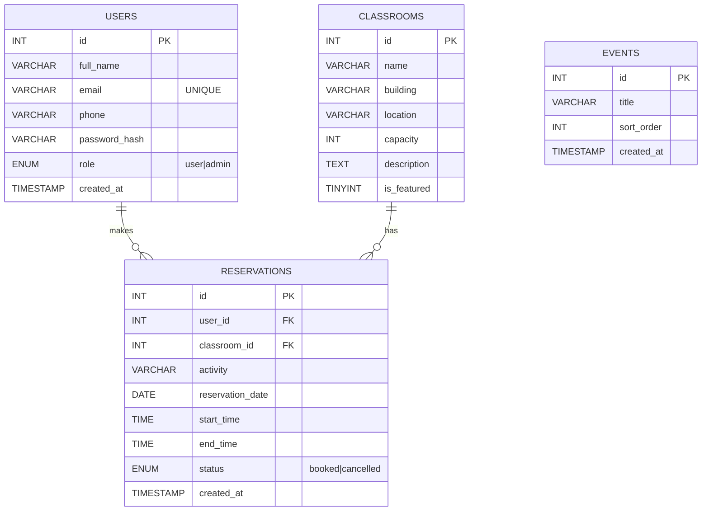
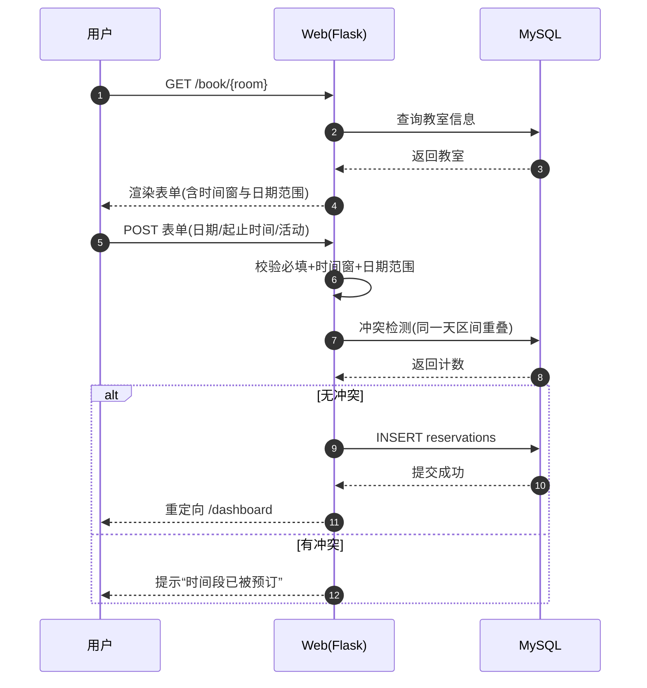

## 教室预约系统网站文档

本系统运行地址为 `http://127.0.0.1:5000/`，后端采用 Flask，数据存储使用 MySQL。功能围绕“浏览教室—登录/注册—下单预约—个人仪表板管理—管理员维护”展开：访客可在首页查看特色教室与活动，进入`/classrooms` 浏览并至详情页；注册或登录后在`/book/{id}` 提交预约，系统按配置的时间窗与可预约天数进行校验，并通过时间段重叠检测避免冲突；预约成功显示在`/dashboard` 可取消；管理员通过`/admin` 维护教室与查看最新预约。系统采用装饰器区分普通用户与管理员，错误信息以闪存提示回显。

### 数据库ER图


### 页面线框图（示意）
首页 `/`：英雄区 + 特色教室卡片 + 近期活动；导航含“教室/登录或仪表板/管理员”。
```
[LOGO] 首页 | 教室 | 仪表板/登录 | 管理员
------------------------------------------------
在线预订您心仪的教室！   [查看课堂]
[教室卡片 x3-4]  |  近期活动列表
```

### 测试要点
- 预约校验：越界日期或时间（默认 08:00–22:00；0–30 天）被拒绝。
- 冲突检测：同教室同日 10:00–11:00 后再约 10:30–11:30 应失败。
- 取消接口：`POST /api/reservations/{id}/cancel` 返回 `{ok:true}`。
- 管理端：新增/编辑/删除教室后首页与列表联动更新。

### 系统架构与配置
- **后端框架**：Flask（单文件应用，使用 Jinja2 模板）。
- **数据库访问**：`db.get_db_connection()` 通过环境变量创建 MySQL 连接（`MYSQL_HOST/PORT/USER/PASSWORD/DB`）。所有写操作均在事务中提交，失败会回滚。
- **会话与鉴权**：使用 Flask `session` 持久化登录状态；`login_required` 与 `admin_required` 装饰器控制访问。
- **预约策略**（可通过环境变量覆盖）：`BOOK_START`/`BOOK_END`（默认 08:00–22:00），`BOOK_MIN_DAYS_AHEAD`/`BOOK_MAX_DAYS_AHEAD`（默认 0–30）。
- **静态资源**：`static/styles.css`、`static/main.js`；页面基础骨架在 `templates/base.html`。

### 主要路由与权限
- `/` 首页：展示特色教室与近期活动。
- `/classrooms` 列表、`/classrooms/<id>` 详情。
- `/book/<id>` 预约表单（需登录）。
- `/dashboard` 用户预约列表，支持取消。
- `/api/reservations/<id>/cancel` 取消预约（POST，需登录）。
- `/admin` 管理员仪表板：查看全部预约与管理教室；`/admin/classrooms/add|edit|delete` 提供 CRUD。

### 预约流程（时序图）


### 数据库说明
- `users.email` 唯一；`reservations` 通过外键与 `users`、`classrooms` 关联，开启级联删除，确保删除用户或教室时相关预约同步移除。
- 时间冲突查询使用复合索引 `idx_reservations_room_date(classroom_id, reservation_date, start_time, end_time)`，并以逻辑 `NOT(end_time<=? OR start_time>=?)` 判断区间重叠，能够在日维度上高效过滤。
- `schema_update_time_window.sql` 为 `classrooms` 增加 `open_time/close_time` 字段（默认 08:00–22:00），便于未来按教室粒度设置开放时段。
- `events` 存放首页活动信息，按 `sort_order` 排序展示。

### 更多页面线框（示意）
教室列表 `/classrooms`
```
[标题] 可用教室
| 名称 | 建筑 | 容量 | [查看详情]
```
教室详情 `/classrooms/<id>`
```
[教室名]  建筑/位置 | 容量
[立即预订]  [返回列表]
```
仪表板 `/dashboard`
```
| 用户 | 教室 | 日期 | 时间 | 状态 | [取消]
```
管理员 `/admin`
```
教室管理： [添加]  | 列表 [编辑][删除]
预约列表： 用户 | 教室 | 日期 | 时间 | 状态
```

### 更完整的测试清单
- 功能路径：注册→登录→预约→查看→取消；管理员登录→新增教室→编辑→删除。
- 边界：开始时间=结束时间、跨日提交、未登录访问受限路由、无效 `room_id`、非法日期格式。
- 并发：同一教室同一时间段提交两笔，后一笔应失败（观察冲突提示）。
- 数据完整性：删除用户/教室后，其预约应被级联删除；邮箱重复注册应失败。
- 性能：同一天近百条预约情况下，列表与冲突检测仍应在可接受时间返回。

### 运行与部署提示
1. 导入 `schema.sql`（可选执行 `schema_update_time_window.sql`）。
2. 设置数据库与预约策略环境变量。
3. `pip install -r requirements.txt` 后执行 `python app.py`，在浏览器访问 `http://127.0.0.1:5000/`。

