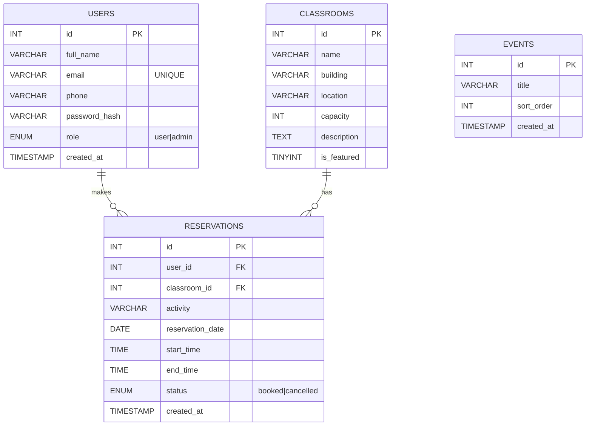
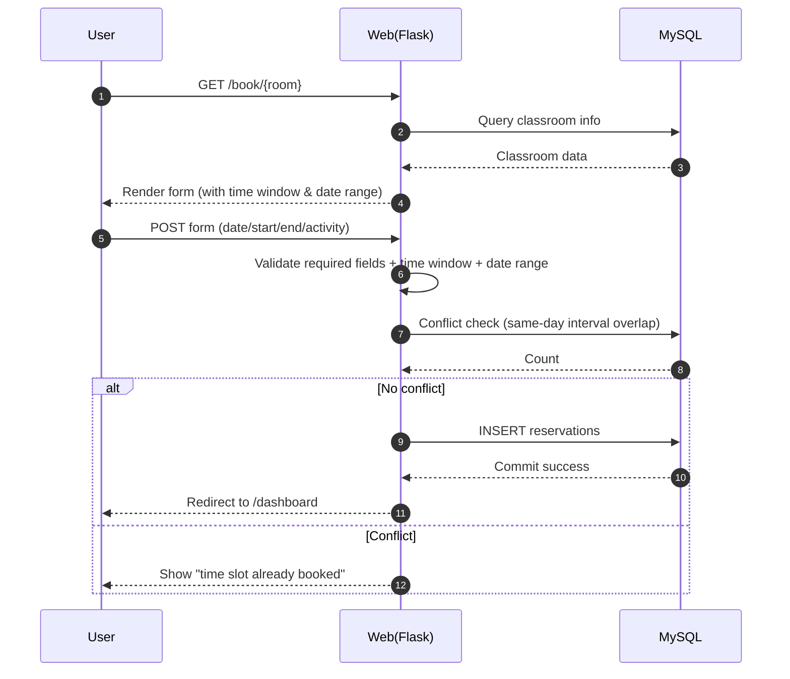

## Classroom Reservation System – Documentation

This application runs at `http://127.0.0.1:5000/`. The backend is built with Flask and data is stored in MySQL. The feature set follows the flow “browse classrooms → log in / register → place a reservation → manage from personal dashboard → admin maintenance.” Visitors can view featured classrooms and recent events on the home page, navigate to `/classrooms` for the list and detail pages, and after login submit a reservation at `/book/{id}`. Submissions are validated against the configured time window and bookable date range, and an overlap check prevents time conflicts. Successful reservations appear on `/dashboard` where users can cancel; admins manage classrooms and review reservations under `/admin`. Access is enforced by decorators for authenticated users and admins, and feedback is shown via flash messages.

### Database ER Diagram


### Page Wireframes (Sketch)
Home `/`: hero section + featured classroom cards + recent events; navigation contains “Classrooms / Dashboard or Login / Admin”.
```
[LOGO] Home | Classrooms | Dashboard/Login | Admin
--------------------------------------------------
Reserve your desired classroom online!   [View Classrooms]
[Classroom Cards x3–4]  |  Recent Events List
```

### Test Highlights
- Reservation validation: out-of-range date or time (default 08:00–22:00; 0–30 days) must be rejected.
- Conflict detection: after 10:00–11:00 exists, 10:30–11:30 on the same day must fail.
- Cancel API: `POST /api/reservations/{id}/cancel` should return `{ok:true}`.
- Admin panel: create/edit/delete classrooms; changes should reflect on the home/list pages.

### Architecture and Configuration
- **Backend**: Flask (single-file app with Jinja2 templates).
- **Database access**: `db.get_db_connection()` uses environment variables (`MYSQL_HOST/PORT/USER/PASSWORD/DB`). All write operations are transactional with rollback on failure.
- **Session and auth**: Flask `session`; `login_required` and `admin_required` decorators gate access.
- **Booking policies** (overridable via env): `BOOK_START`/`BOOK_END` (default 08:00–22:00), `BOOK_MIN_DAYS_AHEAD`/`BOOK_MAX_DAYS_AHEAD` (default 0–30).
- **Static assets**: `static/styles.css`, `static/main.js`; base layout in `templates/base.html`.

### Main Routes and Permissions
- `/` home: featured classrooms and recent events.
- `/classrooms` list, `/classrooms/<id>` details.
- `/book/<id>` reservation form (login required).
- `/dashboard` user reservations with cancel action.
- `/api/reservations/<id>/cancel` cancel by POST (login required).
- `/admin` admin dashboard for classroom CRUD and viewing reservations; `/admin/classrooms/add|edit|delete` provide management endpoints.

### Reservation Flow (Sequence Diagram)


### Database Notes
- `users.email` is unique; `reservations` references `users` and `classrooms` with cascading deletes so related reservations are removed when a user or classroom is deleted.
- Time-conflict detection uses the composite index `idx_reservations_room_date(classroom_id, reservation_date, start_time, end_time)` and logic `NOT(end_time<=? OR start_time>=?)`, which efficiently filters overlaps within the day.
- `schema_update_time_window.sql` adds `open_time/close_time` to `classrooms` (default 08:00–22:00) for per-classroom opening hours in the future.
- `events` stores items displayed on the home page, ordered by `sort_order`.

### More Wireframes (Sketch)
Classroom list `/classrooms`
```
[Title] Available Classrooms
| Name | Building | Capacity | [View Details]
```
Classroom detail `/classrooms/<id>`
```
[Classroom Name]  Building/Location | Capacity
[Book Now]  [Back to List]
```
Dashboard `/dashboard`
```
| User | Classroom | Date | Time | Status | [Cancel]
```
Admin `/admin`
```
Classroom Management:  [Add]  |  List [Edit][Delete]
Reservations: User | Classroom | Date | Time | Status
```

### Comprehensive Test Checklist
- Functional path: register → login → book → view → cancel; admin login → add classroom → edit → delete.
- Edge cases: start time = end time, cross-day inputs, unauthorized access to protected routes, invalid `room_id`, invalid date format.
- Concurrency: two submissions for the same classroom and interval; the latter should fail (observe conflict message).
- Data integrity: deleting a user/classroom should cascade-delete its reservations; duplicate email registration must fail.
- Performance: with many reservations on the same day, list and conflict checks should still respond in acceptable time.

### Run and Deploy
1. Import `schema.sql` (optionally run `schema_update_time_window.sql`).
2. Configure database and booking policy environment variables.
3. `pip install -r requirements.txt` then `python app.py`; open `http://127.0.0.1:5000/` in the browser.


