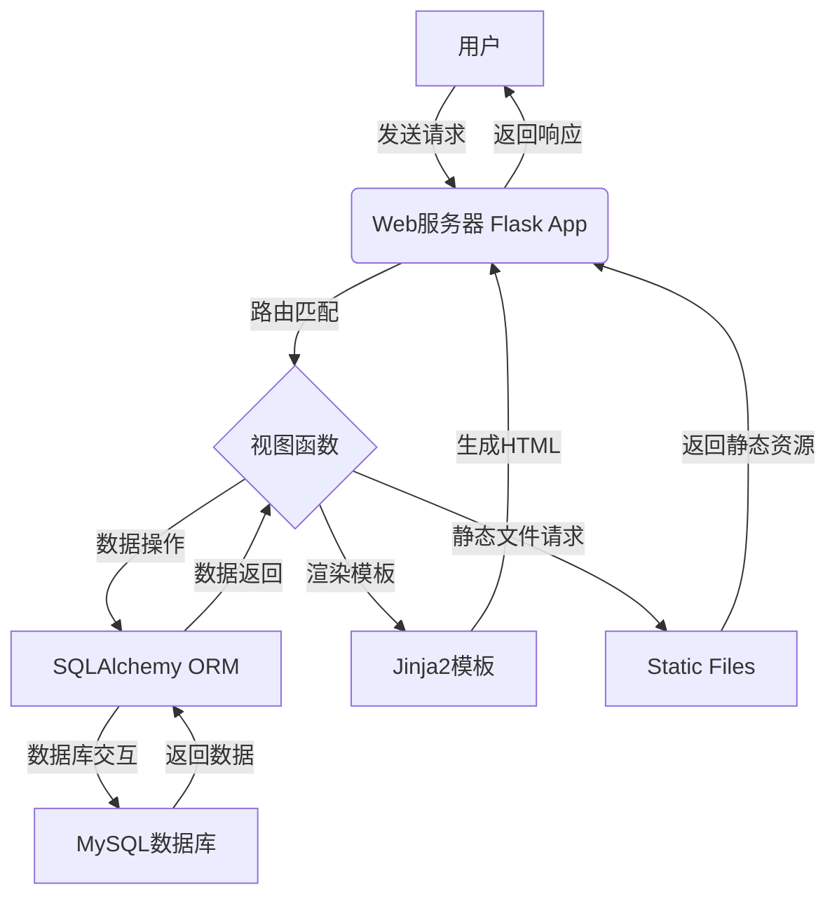
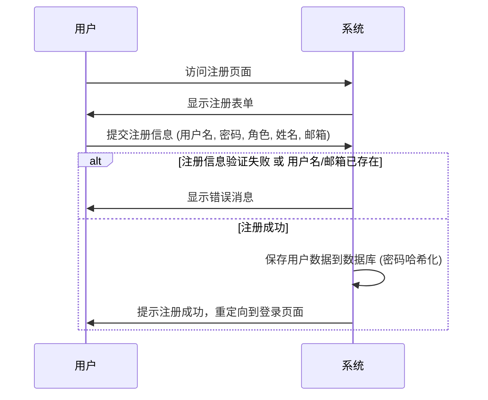
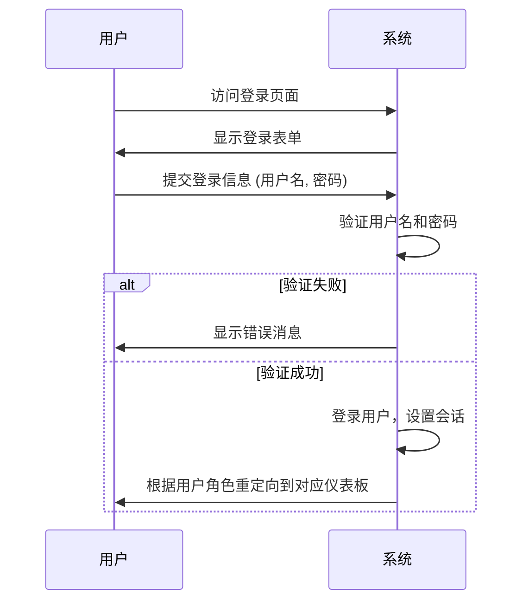
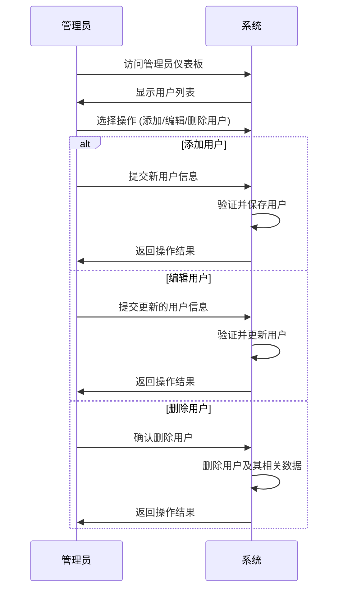
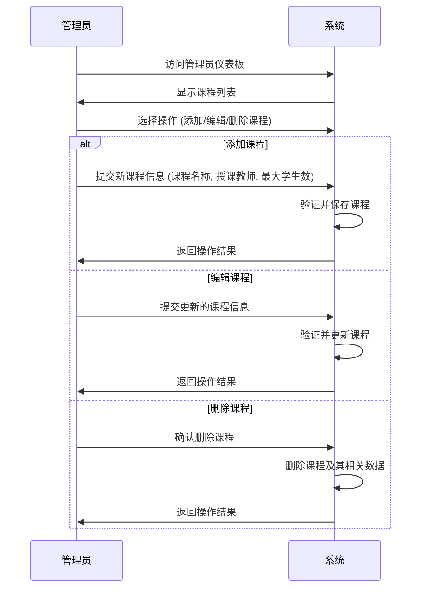
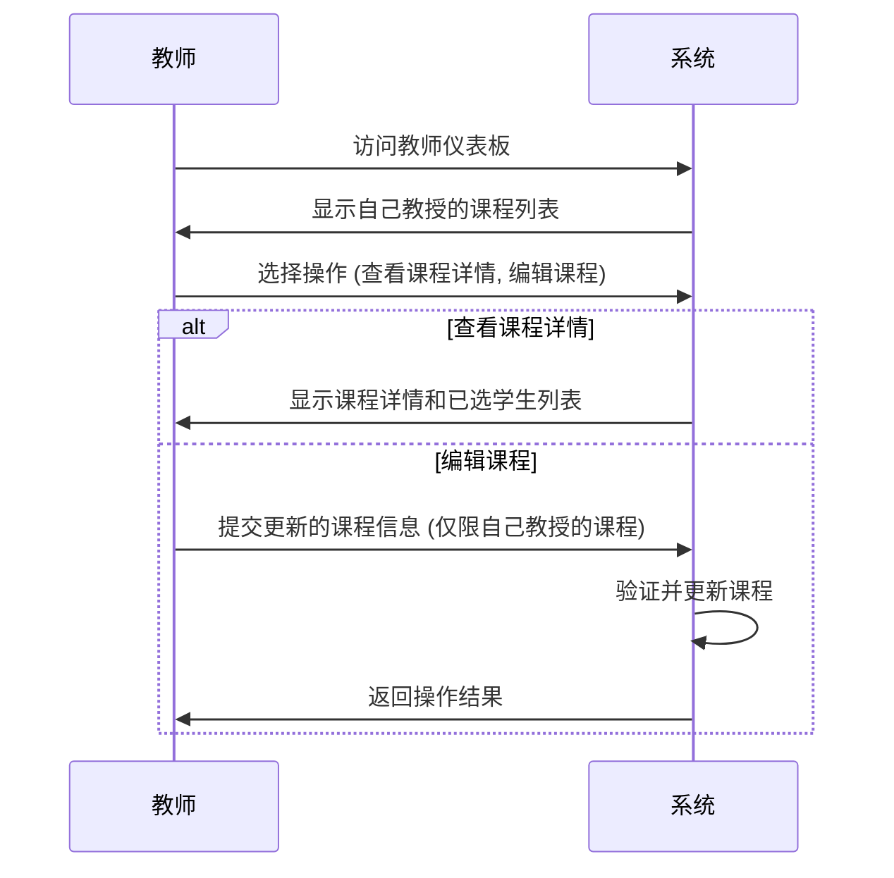
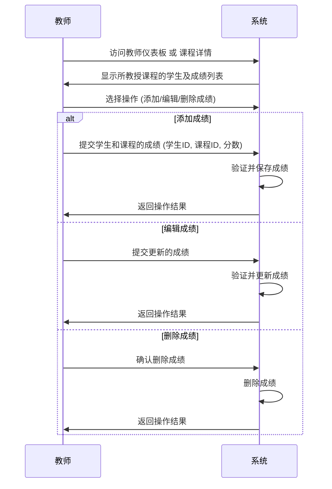
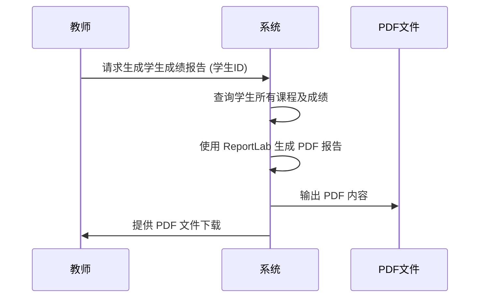
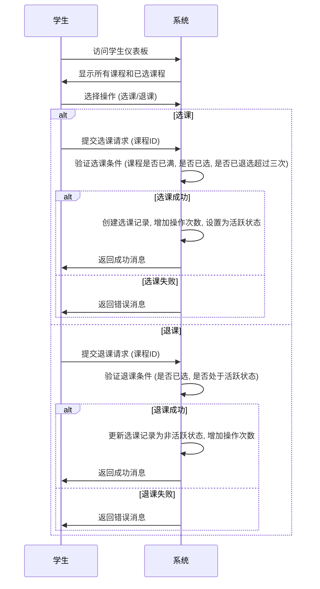
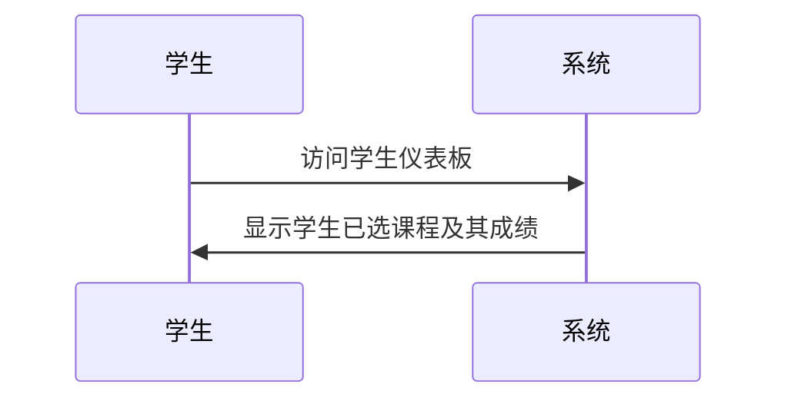

# 成绩管理系统设计文档

## 1. 需求分析——要做哪些功能？

本成绩管理系统旨在为教育机构提供一个高效、安全、易用的平台，以实现学生、教师和管理员之间的成绩管理和信息交互。系统根据用户角色划分权限，提供不同的功能视图。

**主要用户角色及其核心需求：**

*   **管理员 (Admin):**
    *   管理所有用户（学生、教师、其他管理员）的注册、信息编辑和删除。
    *   管理课程的创建、编辑和删除。
    *   查看和管理所有学生的成绩。
    *   系统数据概览，包括用户、课程和成绩数量。

*   **教师 (Teacher):**
    *   管理自己所教授课程的学生成绩（添加、编辑、删除）。
    *   查看自己所教授课程的详细信息和选课学生列表。
    *   查看学生的个人成绩报告。
    *   编辑个人资料。

*   **学生 (Student):**
    *   查看自己已选课程的成绩。
    *   浏览所有可用课程并进行选课/退课操作。
    *   查看个人成绩报告。
    *   编辑个人资料。

**通用需求：**

*   用户注册与登录、注销功能。
*   基于角色的访问控制，确保数据安全和权限隔离。
*   数据持久化，所有信息存储在数据库中。
*   友好的用户界面。
*   提供成绩报告的生成与导出功能。

## 2. 总体框架

本系统采用 `Python Flask` 框架进行后端开发，实现了基于 MVC（Model-View-Controller）思想的应用结构。

### 技术栈

*   **后端技术栈：**
    *   **Web 框架:** Flask
    *   **数据库:** MySQL (通过 PyMySQL 连接)
    *   **ORM (对象关系映射):** Flask-SQLAlchemy
    *   **数据库迁移:** Flask-Migrate
    *   **用户认证:** Flask-Login
    *   **密码安全:** Werkzeug.security (用于密码哈希与验证)
    *   **PDF 生成:** ReportLab (用于生成成绩报告)
    *   **环境管理:** python-dotenv (加载环境变量)

*   **前端技术栈：**
    *   **模板引擎:** Jinja2 (用于渲染 HTML 页面)
    *   **前端技术:** HTML, CSS, JavaScript (可能包含少量 AJAX 请求用于动态数据加载)

### 系统架构概览

*   **入口:** `app.py` 作为 Flask 应用的主入口，定义路由、视图函数和应用配置。
*   **模型 (Models):** 在 `app.py` 中通过 SQLAlchemy 定义 `User`, `Course`, `Enrollment`, `Grade` 等数据库模型，负责数据结构和数据库交互。
*   **视图 (Views):** 通过 `render_template` 函数渲染 `templates` 目录下的 HTML 模板，展示数据和用户界面。
*   **控制器 (Controllers):** `app.py` 中的路由装饰器 `@app.route` 和对应的视图函数承担控制器职责，处理用户请求，调用模型层进行数据操作，并选择合适的视图进行渲染。
*   **静态文件:** `static` 目录下存放 CSS, JavaScript, 图片等静态资源。
*   **数据库:** 使用 MySQL 存储所有业务数据。

## 3. 功能详细设计

系统访问地址：`http://127.0.0.1:5000/`

以下是各角色主要功能的详细设计：

### 3.1 通用功能

*   **首页 (`/`):**
    *   提供系统简介或欢迎信息。
    *   引导用户进行登录或注册。
*   **用户注册 (`/register`):**
    *   允许新用户选择角色（管理员、教师、学生）并填写必要的注册信息（用户名、密码、姓名、邮箱）。
    *   验证用户名是否已存在，确保邮箱格式正确。
    *   将用户密码进行哈希处理后存储。
*   **用户登录 (`/login`):**
    *   用户输入用户名和密码进行身份验证。
    *   根据用户角色重定向到相应的仪表板（管理员、教师、学生）。
*   **用户注销 (`/logout`):**
    *   安全退出当前登录会话。

#### 用户注册流程

**页面描述：注册页面 (`/register`)**
*   **URL:** `http://127.0.0.1:5000/register`
*   **布局:** 简洁的表单布局，居中显示。
*   **包含元素:**
    *   标题："用户注册"
    *   文本输入框：
        *   用户名 (Username)
        *   密码 (Password) - 类型为 `password`
        *   姓名 (Name)
        *   邮箱 (Email) - 类型为 `email`
    *   下拉选择框：角色 (Role) - 选项包括 "管理员", "教师", "学生"
    *   提交按钮："注册"
    *   链接："已有账号？去登录"
    *   错误/成功消息提示区域（使用 Flask `flash` 消息展示）
*   **交互:**
    *   所有字段为必填项。
    *   提交后，后端校验用户名是否唯一，邮箱格式是否正确，并显示相应提示。

#### 用户登录流程

**页面描述：登录页面 (`/login`)**
*   **URL:** `http://127.0.0.1:5000/login`
*   **布局:** 简洁的表单布局，居中显示。
*   **包含元素:**
    *   标题："用户登录"
    *   文本输入框：
        *   用户名 (Username)
        *   密码 (Password) - 类型为 `password`
    *   提交按钮："登录"
    *   链接："没有账号？去注册"
    *   错误消息提示区域（使用 Flask `flash` 消息展示）
*   **交互:**
    *   用户名和密码为必填项。
    *   提交后，后端验证凭据，并根据用户角色导航到对应的仪表板。

### 3.2 管理员功能 (Admin)

管理员通过 `http://127.0.0.1:5000/admin/dashboard` 访问其仪表板，并可执行以下操作：

*   **仪表板 (`/admin/dashboard`):**
    *   显示系统概览，包括用户总数、课程总数、成绩总数。
    *   列出所有注册用户（管理员、教师、学生）、所有课程和所有成绩。
*   **用户管理:**
    *   **添加用户 (`/admin/user/add` - POST):** 允许管理员添加新用户，指定其角色、用户名、密码、姓名和邮箱。
    *   **编辑用户 (`/admin/user/edit/<int:user_id>` - POST):** 允许管理员修改任何用户的角色、姓名、邮箱等信息。
    *   **删除用户 (`/admin/user/delete/<int:user_id>` - POST):** 允许管理员删除现有用户。
*   **课程管理:**
    *   **添加课程 (`/admin/course/add` - POST):** 允许管理员创建新课程，指定课程名称、教师（可选）和最大学生数。
    *   **编辑课程 (`/admin/course/edit/<int:course_id>` - POST):** 允许管理员修改课程信息，如名称、教师、最大学生数。
    *   **删除课程 (`/admin/course/delete/<int:course_id>` - POST):** 允许管理员删除现有课程。
*   **成绩管理:**
    *   **添加成绩 (`/admin/grade/add` - POST):** 允许管理员为特定学生在特定课程中添加成绩。
    *   **编辑成绩 (`/admin/grade/edit/<int:grade_id>` - POST):** 允许管理员修改现有成绩。
    *   **删除成绩 (`/admin/grade/delete/<int:grade_id>` - POST):** 允许管理员删除现有成绩记录。
*   **API 接口 (用于动态数据加载):**
    *   **按课程获取成绩 (`/api/teacher/grades_by_course/<int:course_id>`):** 提供 JSON 接口，获取某课程的所有成绩。
    *   **按课程获取学生 (`/api/teacher/students_by_course/<int:course_id>`):** 提供 JSON 接口，获取某课程的所有学生。

#### 管理员用户管理流程

**页面描述：管理员仪表板 (`/admin/dashboard`)**
*   **URL:** `http://127.0.0.1:5000/admin/dashboard`
*   **布局:**
    *   顶部导航栏：包含"退出登录"等通用选项。
    *   左侧或顶部导航菜单：链接到用户管理、课程管理、成绩管理等模块。
    *   主内容区：概览信息（用户总数、课程总数、成绩总数）及各个数据表格（用户列表、课程列表、成绩列表）。
*   **包含元素:**
    *   **概览卡片:** 显示系统实体数量（用户、课程、成绩）。
    *   **用户列表表格:**
        *   列：ID, 用户名, 姓名, 邮箱, 角色, 创建时间, 更新时间, 操作 (编辑, 删除)
        *   "添加用户"按钮，点击跳转或弹出添加用户表单。
    *   **课程列表表格:**
        *   列：ID, 课程名, 授课教师, 最大学生数, 创建时间, 更新时间, 操作 (编辑, 删除)
        *   "添加课程"按钮。
    *   **成绩列表表格:**
        *   列：ID, 学生, 课程, 分数, 创建时间, 更新时间, 操作 (编辑, 删除)
        *   "添加成绩"按钮。
*   **交互:**
    *   表格数据可分页、排序（如果实现）。
    *   "编辑"按钮：点击后，跳转到用户/课程/成绩的编辑页面或弹出编辑表单，预填充当前数据。
    *   "删除"按钮：点击后，弹出确认框，确认后执行删除操作。

**页面描述：管理员添加/编辑用户页面/表单**
*   **URL:** (添加) `http://127.0.0.1:5000/admin/user/add` (编辑) `http://127.0.0.1:5000/admin/user/edit/<user_id>`
*   **布局:** 包含表单的页面或弹窗。
*   **包含元素:**
    *   标题："添加用户"或"编辑用户"
    *   文本输入框：
        *   用户名 (仅添加时可编辑)
        *   密码 (仅添加时必填，编辑时可选填以修改密码)
        *   姓名
        *   邮箱
    *   下拉选择框：角色 (Admin, Teacher, Student)
    *   提交按钮："保存"或"添加"
    *   取消/返回按钮。
*   **交互:**
    *   编辑时，表单会预填充选定用户的信息。
    *   提交后，后端处理数据，并返回到管理员仪表板，显示成功或失败消息。

#### 管理员课程管理流程

### 3.3 教师功能 (Teacher)

教师通过 `http://127.0.0.1:5000/teacher/dashboard` 访问其仪表板，并可执行以下操作：

*   **仪表板 (`/teacher/dashboard`):**
    *   显示教师个人信息。
    *   列出该教师所教授的所有课程。
    *   提供快速链接到课程详情和成绩管理。
*   **个人资料编辑 (`/teacher/profile/edit` - POST):**
    *   教师可以修改自己的姓名和邮箱。
*   **课程管理:**
    *   **编辑所授课程 (`/teacher/course/edit/<int:course_id>` - POST):** 教师可以修改自己所教授课程的最大学生数等信息。
    *   **课程详情 (`/teacher/course/detail/<int:course_id>`):** 显示特定课程的详细信息，包括已选学生列表和他们的成绩。
*   **学生成绩管理:**
    *   **查看学生成绩 (`/teacher/student/grades/<int:student_id>`):** 查看特定学生的全部成绩。
    *   **添加成绩 (`/teacher/grade/add` - POST):** 教师为自己所教授课程中的学生添加成绩。
    *   **编辑成绩 (`/teacher/grade/edit/<int:grade_id>` - POST):** 教师修改自己所教授课程中的学生成绩。
    *   **删除成绩 (`/teacher/grade/delete/<int:grade_id>` - POST):** 教师删除自己所教授课程中的学生成绩。
    *   **生成成绩报告 (`/teacher/grade/report/<int:student_id>`):** 为特定学生生成并下载 PDF 格式的成绩报告。

#### 教师课程管理流程

**页面描述：教师仪表板 (`/teacher/dashboard`)**
*   **URL:** `http://127.0.0.1:5000/teacher/dashboard`
*   **布局:**
    *   顶部导航栏。
    *   个人信息区域：显示教师姓名、邮箱等。
    *   主内容区：显示该教师所教授的课程列表。
*   **包含元素:**
    *   **个人资料编辑按钮:** 点击跳转到个人资料编辑页面。
    *   **课程列表表格:**
        *   列：ID, 课程名, 最大学生数, 操作 (编辑, 详情, 查看学生成绩)
    *   可能包含一个"添加成绩"的快速入口或按钮。
*   **交互:**
    *   "编辑"按钮：编辑课程基本信息。
    *   "详情"按钮：查看课程详情（已选学生，成绩概览）。
    *   "查看学生成绩"：跳转到该课程下学生的成绩列表。

**页面描述：教师课程详情页面 (`/teacher/course/detail/<course_id>`)**
*   **URL:** `http://127.0.0.1:5000/teacher/course/detail/<course_id>`
*   **布局:** 显示特定课程的详细信息，以及该课程下学生的列表及其成绩。
*   **包含元素:**
    *   课程名称、授课教师、最大学生数等基本信息。
    *   **已选学生列表表格:**
        *   列：学生姓名, 学生邮箱, 操作 (查看成绩, 添加成绩)
    *   "添加成绩"按钮（或在学生行中直接操作）。
*   **交互:**
    *   点击学生姓名或"查看成绩"进入该学生的成绩详情。
    *   点击"添加成绩"或"编辑成绩"打开表单。

**页面描述：教师添加/编辑成绩页面/表单**
*   **URL:** (添加) `http://127.0.0.1:5000/teacher/grade/add` (编辑) `http://127.0.0.1:5000/teacher/grade/edit/<grade_id>`
*   **布局:** 表单页面或弹窗。
*   **包含元素:**
    *   标题："添加成绩"或"编辑成绩"
    *   下拉选择框：学生 (选择该教师所授课程的学生)
    *   下拉选择框：课程 (选择该教师所授课程)
    *   文本输入框：分数 (Score)
    *   提交按钮："保存"或"添加"
    *   取消/返回按钮。
*   **交互:**
    *   编辑时，表单预填充现有成绩信息。
    *   提交后，后端处理，并返回到相应课程或学生成绩列表页面。

#### 教师成绩管理流程

#### 成绩报告生成流程

### 3.4 学生功能 (Student)

学生通过 `http://127.0.0.1:5000/student/dashboard` 访问其仪表板，并可执行以下操作：

*   **仪表板 (`/student/dashboard`):**
    *   显示学生个人信息。
    *   列出学生已选的所有课程及其成绩。
    *   显示所有可供选择的课程。
*   **个人资料编辑 (`/student/profile/edit` - POST):**
    *   学生可以修改自己的姓名和邮箱。
*   **课程选课/退课:**
    *   **选课 (`/student/course/enroll/<int:course_id>` - POST):** 学生选择并注册课程。
    *   **退课 (`/student/course/unenroll/<int:course_id>` - POST):** 学生取消已选课程。
*   **API 接口 (用于动态数据加载):**
    *   **获取学生所选课程 (`/api/student/<int:student_id>/courses`):** 提供 JSON 接口，获取学生所选课程列表。
    *   **获取我的成绩 (`/api/student/my_grades`):** 提供 JSON 接口，获取当前学生的成绩列表。

#### 学生选课/退课流程

**页面描述：学生仪表板 (`/student/dashboard`)**
*   **URL:** `http://127.0.0.1:5000/student/dashboard`
*   **布局:**
    *   顶部导航栏。
    *   个人信息区域。
    *   主内容区：显示已选课程列表和所有可用课程列表。
*   **包含元素:**
    *   **个人资料编辑按钮:** 点击跳转到个人资料编辑页面。
    *   **我的课程列表表格:**
        *   列：课程名, 授课教师, 我的成绩, 操作 (退课)
    *   **所有课程列表表格:**
        *   列：课程名, 授课教师, 最大学生数, 操作 (选课)
*   **交互:**
    *   "退课"按钮：弹出确认框，确认后从课程中退选。
    *   "选课"按钮：点击后，将学生添加到该课程中。

**页面描述：学生个人资料编辑页面 (`/student/profile/edit`)**
*   **URL:** `http://127.0.0.1:5000/student/profile/edit`
*   **布局:** 简单的表单页面。
*   **包含元素:**
    *   标题："编辑个人资料"
    *   文本输入框：姓名, 邮箱
    *   提交按钮："保存"
    *   取消/返回按钮。
*   **交互:**
    *   表单预填充当前学生信息。
    *   提交后，后端更新信息，并返回到学生仪表板。

#### 学生查看成绩流程

## 4. 测试验证

*   **单元测试:** 对核心业务逻辑（如用户认证、成绩计算、数据模型操作）进行单元测试，确保其正确性。
*   **集成测试:** 测试不同模块之间的交互，例如用户注册后能否正常登录，选课后能否在教师端看到学生选课信息等。
*   **系统测试:** 模拟真实用户场景，验证整个系统的功能、性能、安全性和可用性。
    *   **功能测试:** 验证所有功能是否按需求实现。
    *   **权限测试:** 验证不同角色用户是否只能访问其被授权的功能和数据。
    *   **异常处理测试:** 测试输入无效数据、网络中断等异常情况下的系统表现。
*   **前端测试:** 验证用户界面在不同浏览器和设备上的兼容性和响应性。

## 5. 总结

本成绩管理系统能够有效满足教育机构在用户、课程和成绩管理方面的需求。通过明确的角色权限划分和完善的功能设计，系统旨在提供一个安全、高效且用户友好的操作环境。未来的改进方向可能包括更丰富的数据统计报表、消息通知功能以及与外部系统的集成。 