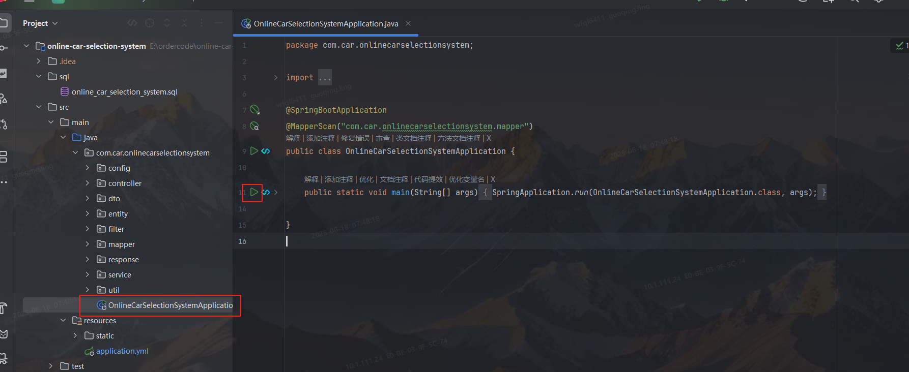

# 如何启动项目
- jdk 1.8
- 修改**yml**中连接数据库的密码
```yml
url: jdbc:mysql://localhost:3306/online_car_selection_system?useSSL=false&serverTimezone=UTC
username: root
password: 123456 # 更改成自己电脑mysql的密码
driver-class-name: com.mysql.cj.jdbc.Driver 
```
- 创建数据库 **online_car_selection_system**
- 创建数据库后将，将目录下sql/online_car_selection_system.sql。中的sql语句运行
- 然后启动项目即可
